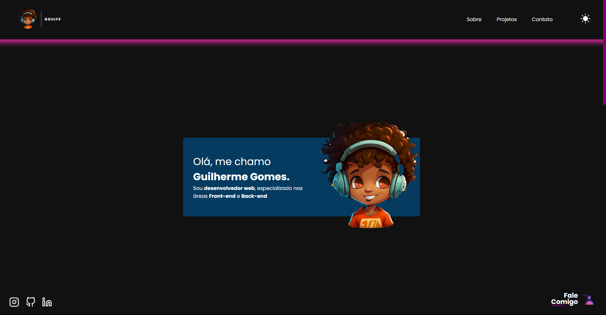

# Gguife Portfolio
<p align="center">Criação do meu portfolio para mostrar um pouco do meu conhecimento.</p>


<h3>O que o site contém?</h3>

- [x] Site totalmente responsivo e intuitivo.
- [x] Um pouco sobre mim e sobre  os projetos já realizados.
- [x] Todos os meus dados facilitando você a entrar em contato comigo.

<hr>
<h1 align="center">
  
</h1>
<p>Clicando aqui você é direcionado ao site:<a href="https://gguife.vercel.app/"> Gguife</a></p>

### 🛠 Tecnologias

As seguintes ferramentas foram usadas na construção do projeto:

- React
- TypeScript
- Style-components

### Pré-requisitos

Antes de começar, você vai precisar ter instalado em sua máquina as seguintes ferramentas:
[Git](https://git-scm.com). <br>
Além disto é bom ter um editor para trabalhar com o código como [VSCode](https://code.visualstudio.com/)

### 🎲 Rodando

```bash
# Clone este repositório
$ git clone <https://github.com/Gguife/Principal-portfolio>

# Instale as dependências
$ npm install

# Execute a aplicação em modo de desenvolvimento
$ npm run dev

# O servidor inciará na porta:5173
```
